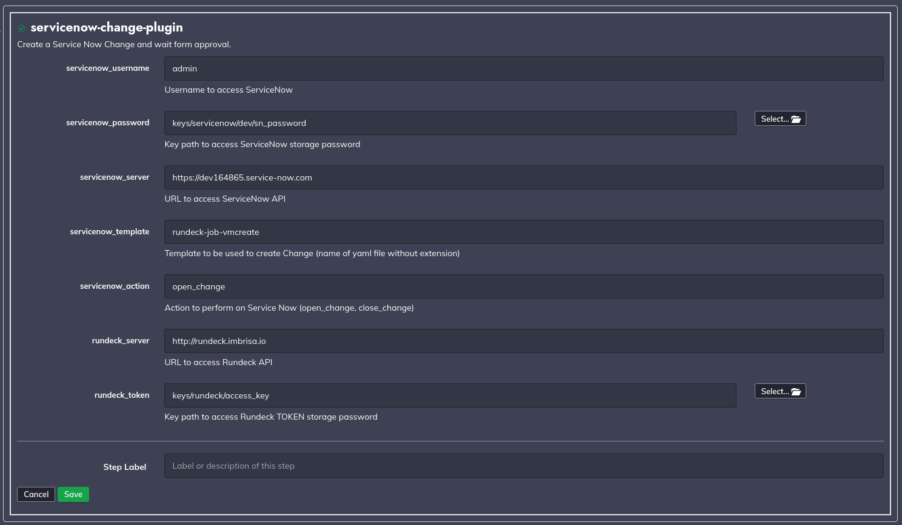

# rundeck-servicenow-plugin

This plugin can be used in a Rundeck workflow to create and close a Service Now change.

## Features
- Open a Service Now Change;
- Close a Service Now Change;

## How it works
Basically, we can create two types of steps using this plugin: <b>```open_change```</b> and <b>```close_change```</b>. 

When <b>```open_change```</b> is used, the plugin will connect to Service Now, create a change and wait for approval. This step will finish when the Change was approved or rejected. If the change was approved, the plugin will finishes with success and the next step will be executed. If the change was rejected, the plugin will finish with error and the next step will not be executed.

When a change is created with this plugin, a file is created in a temporary filesystem with change information. This file is used for the <b>```close_change```</b> step to recovery a change number associated with the job id. So the action <b>```close_change```</b> can be used in two situations:

 - <b>on the same job that ```open_change``` was used:</b> the plugin will use the current job id to recovery the change information;
 - <b>create a job with a step to ```close_change```</b>: this step uses <b>```${RD_OPTION_JOB_ID}```</b> variable content, so you need to configure <b>```JOB_ID```</b> option passing the job id;


## Requirements

This plugins uses Python3 to interact with Service Now, to work this plugins requires the following python libraries:
- requests;
- PyYAML;


To instal this libraries executes the following command:
```bash
$ pip3 install PyYAML requests
```

Be sure that the following path exists:
```bash
$ ls -l /usr/bin/python3
```

## Build
```
make clean build
```

## Install

```
cp build/libs/servicenow-approval-plugin.zip $RDECK_BASE/libext
```

## Plugin configuration example

The following configuration is required by the plugin:
  - <b>```servicenow_username```:</b>
    - <b>description:</b> Username with permissions to create a Change on ServiceNow. 
    - <b>type:</b> String
  - <b>```servicenow_password```:</b>
    - <b>description:</b> Path to Rundeck Key Storage to access ServiceNow password.
    - <b>type:</b> String
  - <b>```servicenow_server```:</b>
    - <b>description:</b> URL to connect to ServiceNow.
    - <b>type:</b> String
  - <b>```servicenow_action```:</b>
    - <b>description:</b> Action to perform on ServiceNow. Needs to be <b>open_change</b> or <b>close_change</b>.
    - <b>type:</b> String 
  - <b>```rundeck_server```:</b> 
    - <b>description:</b> URL to connecto to Rundeck.
    - <b>type:</b> String
  - <b>```rundeck_token```:</b>
    - <b>description:</b> Path to Rundeck Key Storage to access Rundeck API token.
    - <b>type:</b> String


### Screenshot of Plugin configuration




